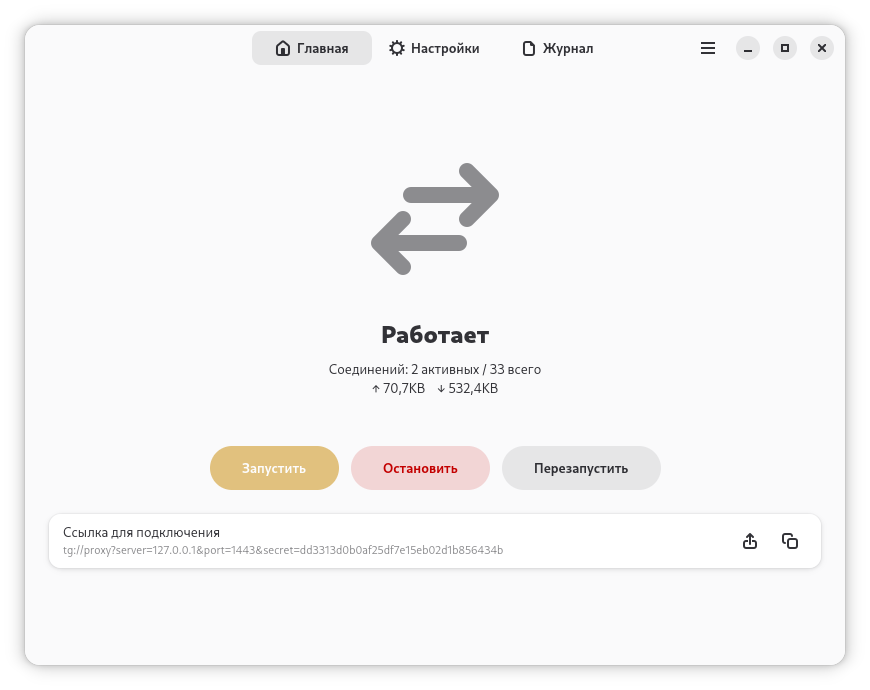
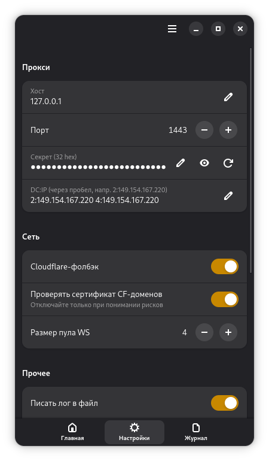

<div align="center">


# Another TGProxy

**GTK4 / libadwaita интерфейс и фоновый демон для движка `mtproxy-ws`.**

[](LICENSE)


**Русский** · [English](README.en.md)

</div>

---

Нативное приложение (десктоп и Android) для прокси Telegram MTProto↔WebSocket
**[mtproxy-ws](https://github.com/Another-TGProxy/mtproxy-ws)**. На десктопе
запускает прокси фоновым демоном без окна и даёт окно управления: живой статус
(соединения, трафик), ссылку `tg://proxy`, настройки и просмотр лога.

<div align="center">




</div>

## 🖥️ Режимы вывода статуса

Прокси работает **фоновым демоном**, отдельным от окна, — закрытие окна не
останавливает прокси. Где показывать живой статус, выбирается в Настройках:
приложение определяет в рантайме систему/окружение/способ поставки и предлагает
только доступные режимы (по умолчанию — лучший: трей → фон → окно).

| Режим | Что это | Где |
|---|---|---|
| **Окно** | Статус в окне приложения | везде (фолбэк) |
| **Трей** | Иконка в трее (SNI): меню, статус-заголовок, тултип | KDE/XFCE/…, GNOME с AppIndicator; нативно Windows/macOS |
| **Фон** | GNOME *«Фоновые приложения»* с настраиваемой строкой статуса | Linux + GNOME + Flatpak |
| **Быстрые настройки** | Тоггл в Quick Settings через [расширение GNOME Shell](https://github.com/Another-TGProxy/another-tgproxy-extension) | Linux + GNOME + расширение |

## 🔨 Сборка

Сначала соберите и установите ядро `mtproxy-ws`, затем GUI поверх него:

```sh
meson setup ../core/build ../core && sudo ninja -C ../core/build install
meson setup build && ninja -C build && ./build/tg-ws-proxy
```

Зависимости: `gtk4`, `libadwaita-1` (≥ 1.7), `glib-2.0`/`gio-2.0`/`gio-unix-2.0`,
`json-glib-1.0`, `vala`, `meson`, `ninja`, `blueprint-compiler`. Опция
`-Dprofile=development` даёт изолированную dev-сборку (app-id `.Devel`).
Кроссплатформенную интеграцию (трей, control-IPC, шелл-хелперы, Android-фон) даёт
**[libstation](https://github.com/Ampernic/libstation)**, подключаемая сабпроектом.

## 📦 Flatpak

Из репозитория [flatpak.ampernic.space](https://flatpak.ampernic.space):

```sh
flatpak remote-add --if-not-exists --user \
    ampernic https://flatpak.ampernic.space/ampernic.flatpakrepo
flatpak install --user ampernic space.ampernic.AnotherTGProxy
flatpak run space.ampernic.AnotherTGProxy
```

Под Flatpak демон поднимается отдельным инстансом (D-Bus-активация), переживает
закрытие окна и появляется в GNOME «Фоновые приложения».

## 🧱 Архитектура

Фоновый демон (`src/daemon/`) держит движок и control-канал; тонкий GUI
(`src/ui/`) и контроллер (`src/controller/`) общаются с ним по IPC. Общий
жизненный цикл движка — `src/engine-runner.vala` (его же использует Android-хост,
работающий в одном процессе). Платформенная интеграция (трей, IPC, автозапуск,
Android-фон) вынесена в [libstation](https://github.com/Ampernic/libstation).

## 🔒 Безопасность

Безопасность переписки обеспечивает сам **MTProto** (end-to-end между клиентом и
дата-центром). Прокси и его TLS — лишь обфусцирующая обёртка. Подробнее — в
[ядре mtproxy-ws](https://github.com/Another-TGProxy/mtproxy-ws#-безопасность).

## 📦 Дистрибуция

- **Android.** Foreground-сервис (`specialUse`) + исключение из battery-optimization
  ограничены в Google Play, поэтому сборка рассчитана на сайдлоад/личный репозиторий,
  а не на публикацию в Play. APK подписан релизным ключом.
- **macOS / Windows.** `.dmg` и `setup.exe` не подписаны и не нотаризованы. На macOS
  разрешите запуск в *Системные настройки → «Конфиденциальность и безопасность»*.

## 📄 Лицензия

[GPL-3.0-or-later](LICENSE).

<div align="center"><sub>Часть <b><a href="https://github.com/Another-TGProxy">Another TGProxy</a></b></sub></div>
